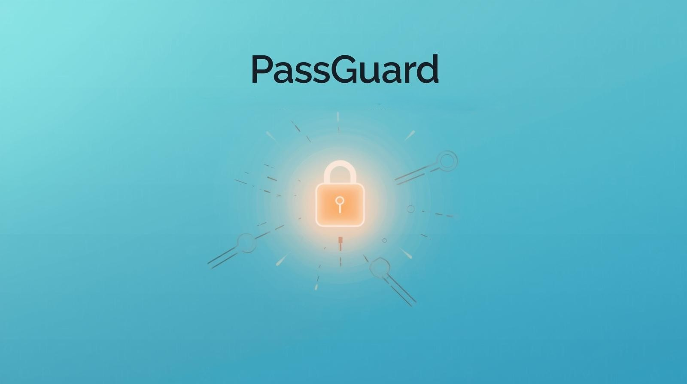

# PassGaurd 🔐

**PassGaurd** is a multi-category crowdfunding platform that enables users to create and support campaigns across various causes including Medical, Educational, Business and Emergency needs.



---

## 🌟 Features

- **Multi-Category Support**: Medical, Educational, Business and Emergency campaigns
- **Campaign Management**: Create, browse, and support campaigns with detailed progress tracking
- **Secure Donations**: Integrated payment gateway support (ready for Stripe, PayPal, Razorpay)
- **Responsive Design**: Built with Bootstrap 5 for mobile-first, responsive layouts
- **Milestone-Based Funding**: Transparent fund release based on campaign milestones
- **User Authentication**: Sign-in and registration system
- **Campaign Discovery**: Browse trending and featured campaigns
- **Individual Campaign Pages**: Detailed pages with updates, donations, and organizer info

---

## 🚀 Technologies Used

- **HTML5** - Structure and semantic markup
- **CSS3** - Custom styling and animations
- **Bootstrap 5.3.2** - Responsive grid system and components
- **Font Awesome 6.4.0** - Icons and visual elements
- **Google Fonts (Inter)** - Modern, clean typography
- **JavaScript** - Form handling and interactivity (ready for enhancement)

---

## 📁 Project Structure

```
VenturaFund/
├── index.html # Homepage
├── signIn.html # Sign-in page
├── signUp.html # Registration page
├── script.js # Javascript
├── discover.html # Main Campaigns Page
├── donation.html # Universal donation page
├── formDetails.js # Form Validation Javascript
├── styles.css # Main stylesheet
├── images/ # Image assets
│   ├── ArtSupplies.jpg
│   ├── Cancer.jpg
│   ├── Business.jpg
│   ├── Emergency.jpg
│   ├── Dialysis.jpg
│   └── EarthquakeRelief.jpg
│   └── EcoCafe.jpg
│   └── Educational Featured.jpg
│   └── Educational.jpg
│   └── FireRelief.jpg
│   └── FloodRelief.jpg
│   └── Heart.jpg
│   └── Hero.jpg
│   └── JewelryWorkshop.jpg
│   └── Medical Featured.jpg
│   └── Medical.jpg
│   └── MobileBakery.jpg
│   └── RescueSupport.jpg
│   └── Sarah.jpg
│   └── Schoralship.jpg
│   └── STEMLAB.jpg
│   └── TechStartup.jpg
├── categories/
│   ├── medical/
│   │   ├── medicalCampaigns.html
│   │   └── campaigns/
│   │       ├── Cancer.html
│   │       ├── Dialysis.html
│   │       ├── Heart.html
│   │       └── Sarah.html
│   ├── educational/
│   │   ├── educationalCampaigns.html
│   │   └── campaigns/
│   │       ├── SchoolLibrary.html
│   │       ├── STEMLab.html
│   │       ├── Scholarship.html
│   │       └── ArtSupplies.html
│   ├── business/
│   │   ├── businessCampaigns.html
│   │   └── campaigns/
│   │       ├── EcoCafe.html
│   │       ├── MobileBakery.html
│   │       ├── TechStartup.html
│   │       └── JewelryWorkshop.html
│   └── emergency/
│       ├── emergencyCampaigns.html
│       └── campaigns/
│           ├── FloodRelief.html
│           ├── FireRelief.html
│           ├── EarthquakeRelief.html
│           └── RescueSupport.html
└── start-a-campaign/
    ├── startCampaign.html
    ├── storyMedia.html
    └── reviewLaunch.html
```

---

## 🛠️ Installation & Setup

### Prerequisites
- GCC or compatible C compiler
- raylib library installed on your system

### Steps

1. **Clone the repository**

```
git clone https://github.com/YourUsername/PassGuard.git
cd PassGuard
```


2. **Compile the project**

```
gcc main.c -o passguard -lraylib -lm -lpthread -ldl -lrt -lX11
```
*(Adjust compile flags if required for your OS and raylib version.)*


3. **Run the application**

```
./passguard
```


---

## 🎨 Customization

### Colors & UI
- Edit color themes and UI components directly in the `main.c` file or your raylib settings.

### Adjusting Password Settings
- Change encryption key, minimum password length, or validation requirements by modifying constants at the top of `main.c`:
    ```
    #define ENCRYPTION_KEY 5
    #define MIN_PASSWORD_LENGTH 6
    ```

### Adding Users (for testing)
- Run the application, use the 'Register' feature, and input unique usernames and passwords that meet criteria.


## 🔮 Future Enhancements

- Database integration (SQLite, MySQL) for large-scale user storage  
- Backend integration (Node.js, Python, etc.) for multi-user support  
- Advanced encryption (bcrypt, Argon2, SHA-256) for stronger password protection  
- Web or mobile app (React Native / Flutter) – build for Android/iOS devices  
- Multi-factor authentication (MFA) for increased security  
- User authorization levels (e.g., admin tools)  
- Password strength meter and checker  
- Password generator for secure random passwords  
- Activity logging and audit trails for user actions  
- Session management and automatic logout  
- Email notifications (for registration, password changes, account activity)  
- UI enhancements: modern design, light/dark theme  
- Import/export password database (CSV/JSON backup)  
- Cloud sync (optional) for cross-device password management  
- Accessibility and localization (multi-language support)  
- Integration with browser extensions or autofill services  

---

## 👀 Quick Peek

### Homepage


### Campaign Listing


### Donation Page


---

## 🤝 Contributing

Currently not accepting contributions (college project).  
Feel free to clone the repo and experiment.

---

## 📄 License

This project is licensed under the MIT License.  
See the [LICENSE](LICENSE) file.

---

## 👥 Authors

- **Ronel Abraham Mathew** – Landing Page, Start a Campaign Page & UI/UX  
  GitHub: [RM1338](https://github.com/RM1338)  
  LinkedIn: [Ronel Abraham Mathew](https://linkedin.com/in/ronelm)

- **Joshua Sibichan Scariya** – Sign In/Up, Business & Emergency Pages, Interactive JS  
  GitHub: [BuildwJoshh](https://github.com/BuildwJoshh)  
  LinkedIn: [Joshua Sibichan Scariya](https://www.linkedin.com/in/joshua-sibichan-scariya-141488380/)

- **Aditilakshmanan** – Medical & Educational Pages  
  GitHub: [BuildwJoshh](https://github.com/)  
  LinkedIn: [](https://www.linkedin.com/in//)

- **Yogesh** – Research & Donation Page  
  GitHub: [Yogesh](https://github.com/)  
  LinkedIn: [Yogesh](https://linkedin.com/in/)

---

## 📞 Contact

**Ronel Abraham Mathew**  
Email: rma80070@gmail.com  
GitHub: [RM1338](https://github.com/RM1338)  
LinkedIn: [Ronel Abraham Mathew](https://linkedin.com/in/ronelm)

**Joshua Sibichan Scariya**  
Email: joshuasibichan7@gmail.com  
GitHub: [BuildwJoshh](https://github.com/BuildwJoshh)  
LinkedIn: [Joshua Sibichan Scariya](https://linkedin.com/in/joshua-sibichan-scariya-141488380/)  

**Aditilakshmanan**  
Email:   
GitHub: [](https://github.com/)  
LinkedIn: [](https://www.linkedin.com/in//)

**Yogesh**  
Email: yogesh@gmail.com  
GitHub: [Yogesh](https://github.com/SarveshAK7786)  
LinkedIn: [Yogesh](https://linkedin.com/in/sarvesh-a-b27010377)

---

## ⭐ Show Your Support

Give a ⭐️ if this project helped you!

---

Made with ❤️ by the CodeGen Team